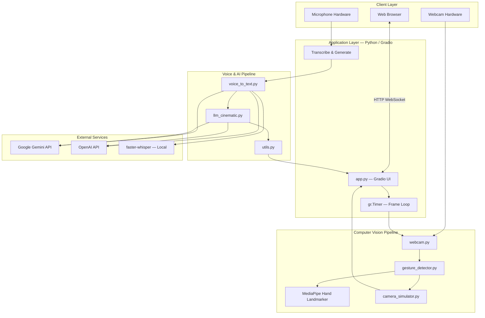
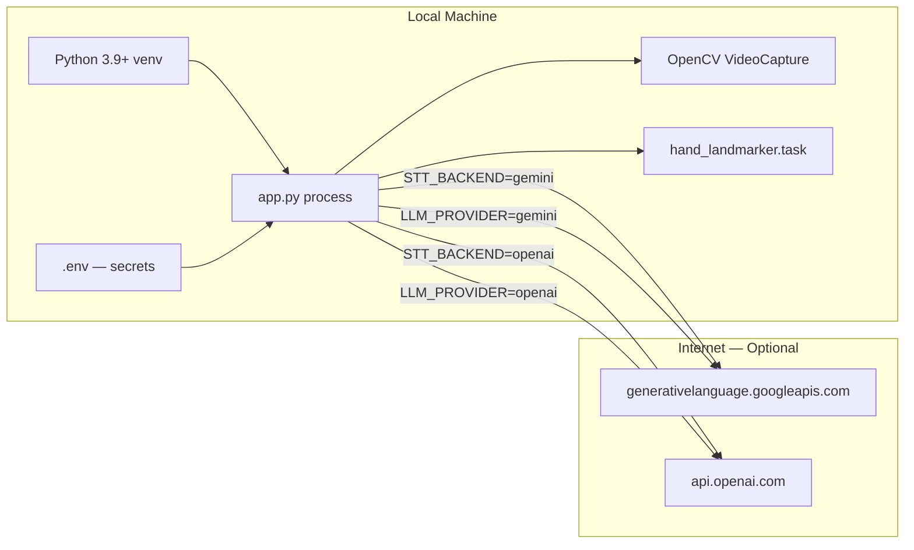
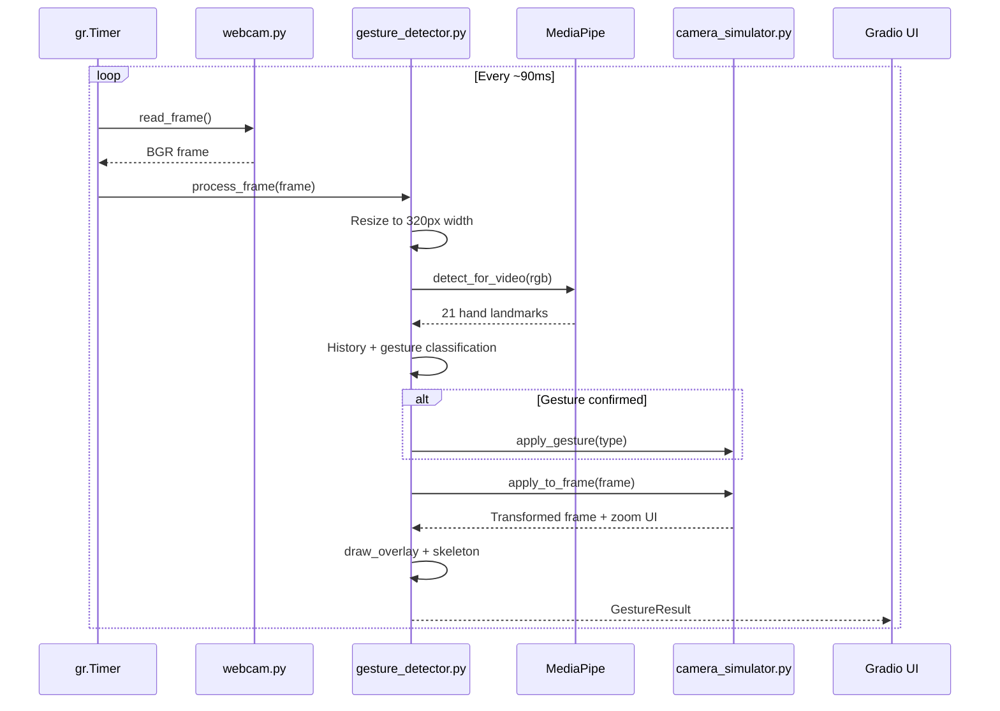
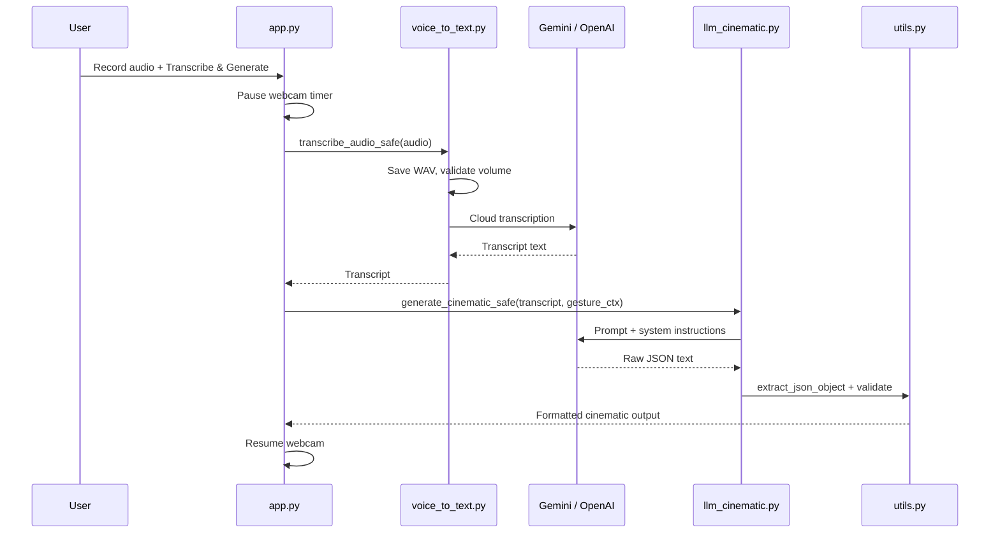
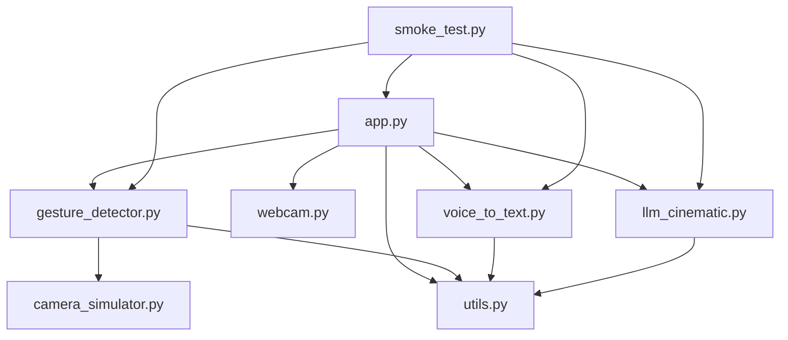

# AI Virtual Camera Control — Technical Documentation

**Project:** AI Virtual Camera Control (Proof of Concept)  
**Repository:** [github.com/vijayshreepathak/Ai-Virtual-Cammera-Control](https://github.com/vijayshreepathak/Ai-Virtual-Cammera-Control)  
**Version:** 1.0  
**Document type:** Technical submission report  

---

## 1. Executive Summary

This project implements an end-to-end **AI-powered virtual camera control system** that combines:

1. **Real-time hand gesture recognition** using MediaPipe Hand Landmarker  
2. **Virtual camera simulation** with visible zoom, pan, and tilt on a live webcam feed  
3. **Voice-driven cinematic planning** via speech-to-text and large language model (LLM) inference  
4. **Structured JSON output** describing camera movement, emotion, shot style, reasoning, and confidence  

The system is delivered as a modular Python application with a **Gradio** web interface, suitable for internship demonstrations, proof-of-concept reviews, and future integration with real camera rigs or video production pipelines.

---

## 2. System Architecture

### 2.1 High-Level Architecture Diagram



### 2.2 Layered Architecture

| Layer | Components | Responsibility |
|-------|------------|----------------|
| **Presentation** | `app.py`, Gradio Blocks | User interface, event binding, status display |
| **Vision** | `gesture_detector.py`, `camera_simulator.py`, `webcam.py` | Capture frames, detect gestures, apply virtual camera transform |
| **Speech** | `voice_to_text.py` | Convert microphone audio to text |
| **Intelligence** | `llm_cinematic.py` | Generate validated cinematic JSON from transcript |
| **Infrastructure** | `utils.py`, `.env`, `smoke_test.py` | Configuration, validation, overlays, health checks |

### 2.3 Deployment / Runtime View



---

## 3. Data Flow Diagrams

### 3.1 Real-Time Gesture Pipeline



### 3.2 Voice + LLM Pipeline



### 3.3 Module Dependency Graph



---

## 4. Technology Stack

### 4.1 Core Stack Summary

| Category | Technology | Version / Notes | Role |
|----------|------------|-----------------|------|
| **Language** | Python | 3.9+ (3.11 recommended) | Primary runtime |
| **UI Framework** | Gradio | 4.44.x | Web-based demo interface |
| **Computer Vision** | OpenCV | ≥ 4.9.0 | Webcam capture, frame transforms, overlays |
| **Hand Tracking** | MediaPipe Tasks API | ≥ 0.10.14 | 21-point hand landmark detection |
| **Numerical** | NumPy | ≥ 1.26.0 | Array operations on frames and audio |
| **Audio I/O** | SciPy | ≥ 1.11.0 | WAV file writing for STT input |
| **Configuration** | python-dotenv | ≥ 1.0.0 | `.env` loading with project-root override |
| **LLM — Gemini** | google-generativeai | ≥ 0.7.0 | Transcription + cinematic JSON generation |
| **LLM — OpenAI** | openai | ≥ 1.40.0 | Optional Whisper STT + GPT cinematic output |
| **Local STT** | faster-whisper | ≥ 1.0.0 | Offline Whisper inference (CPU, int8) |
| **Model Hub** | huggingface-hub | 0.19–0.x | Gradio dependency compatibility pin |

### 4.2 External Models & Assets

| Asset | Source | Purpose |
|-------|--------|---------|
| `hand_landmarker.task` | Google MediaPipe model zoo | Hand landmark inference (auto-downloaded) |
| `gemini-2.0-flash` | Google Generative Language API | STT + LLM (configurable) |
| `gpt-4o-mini` | OpenAI API | LLM (configurable) |
| `whisper-1` | OpenAI API | Cloud STT (configurable) |
| `tiny` Whisper | faster-whisper local | Offline STT (configurable) |

### 4.3 Design Patterns Used

| Pattern | Implementation |
|---------|----------------|
| **Singleton** | `GestureDetector`, `SpeechToText`, `VideoCapture` lazy init in `app.py` |
| **Strategy** | Pluggable STT backends (`gemini`, `openai`, `faster-whisper`) |
| **Strategy** | Pluggable LLM providers (`gemini`, `openai`) |
| **State machine** | Gesture history deque + cooldown + consistency scoring |
| **Pipeline** | Frame → detect → classify → transform → overlay → UI |
| **Graceful degradation** | `*_safe()` wrappers return errors without crashing UI |

---

## 5. Module Specifications

### 5.1 `app.py` — Application Orchestrator

- Builds Gradio `Blocks` UI with dark theme and custom CSS  
- Runs `gr.Timer(0.09)` for ~11 FPS UI updates (server-side webcam)  
- Pauses webcam during voice processing to prevent Gradio queue blocking  
- Manages global webcam lifecycle (connect, restart, black-frame recovery)  
- Wires: pause, sensitivity, reset camera, transcribe & generate  

### 5.2 `gesture_detector.py` — Gesture Engine

**Input:** BGR numpy frame from webcam  
**Output:** `GestureResult` (labels, confidence, annotated frame, FPS)

**Algorithm:**

1. Downscale frame to 320px width for faster inference  
2. Run MediaPipe `HandLandmarker` in `VIDEO` mode  
3. Track wrist X/Y and hand bounding-box area over a sliding window (10 frames)  
4. Compute movement delta and directional consistency per axis  
5. Classify dominant motion:
   - Horizontal wrist delta → Pan Left / Pan Right  
   - Hand area change → Zoom In / Zoom Out  
   - Upward wrist delta → Tilt Up  
6. Apply cooldown (0.85s) and minimum confidence threshold  
7. Trigger `VirtualCamera.apply_gesture()` on confirmed gesture  

**Supported gestures:**

| Enum | Label | Trigger condition |
|------|-------|-------------------|
| `PAN_RIGHT` | Pan Right | Dominant horizontal motion, left→right |
| `PAN_LEFT` | Pan Left | Dominant horizontal motion, right→left |
| `ZOOM_IN` | Zoom In | Hand area increasing (toward camera) |
| `ZOOM_OUT` | Zoom Out | Hand area decreasing (away from camera) |
| `TILT_UP` | Tilt Up | Dominant upward wrist motion |

### 5.3 `camera_simulator.py` — Virtual Camera

Maintains `CameraViewState` with:

- `zoom` — 0.72× to 2.4×  
- `pan_x`, `pan_y` — normalized shift (−38% to +38%)  

**Transform:** center crop by zoom factor → shift by pan → resize to original resolution → draw zoom bar UI.

Uses exponential smoothing (`alpha=0.28`) for fluid visual transitions.

### 5.4 `webcam.py` — Camera Discovery

- Scans camera indices 0–4 with DirectShow (Windows)  
- Validates frames are not uniformly black (brightness threshold)  
- Returns first working `cv2.VideoCapture` with diagnostic label  

### 5.5 `voice_to_text.py` — Speech-to-Text

| Backend | Method | Latency | Requirements |
|---------|--------|---------|--------------|
| `gemini` | Upload WAV → Gemini `generate_content` | Low (cloud) | `AIza` API key |
| `openai` | OpenAI `audio.transcriptions` | Low (cloud) | `sk-` API key |
| `faster-whisper` | Local `WhisperModel` CPU int8 | High first run | No API key |

Audio preprocessing: mono conversion, int16 normalization, peak amplitude check (rejects silent clips).

### 5.6 `llm_cinematic.py` — Cinematic Generator

**System prompt** instructs the LLM to return **only** JSON with keys:

```json
{
  "camera_movement": "string",
  "emotion": "string",
  "shot_style": "string",
  "reasoning": "string",
  "confidence": 0.0
}
```

**Validation pipeline (`utils.validate_cinematic_output`):**

- Ensures all required keys exist  
- Coerces `confidence` to float in [0.0, 1.0]  
- Extracts JSON from markdown-wrapped responses via regex fallback  

Optional **gesture context** is prepended to the user prompt when the checkbox is enabled.

### 5.7 `utils.py` — Shared Infrastructure

- `load_dotenv(.env, override=True)` — project `.env` overrides stale OS env vars  
- `is_valid_gemini_api_key_format()` — rejects invalid `AQ.` keys  
- `draw_overlay()` — OpenCV HUD (gesture, action, confidence, FPS, zoom state)  
- `patch_gradio_client()` — fixes Gradio JSON schema boolean crash  
- `system_status()` — runtime readiness string for UI  

---

## 6. API Integration

### 6.1 Google Gemini (Primary)

| Use case | Endpoint / SDK | Model |
|----------|----------------|-------|
| Speech-to-text | `google.generativeai` file upload + `generate_content` | `GEMINI_MODEL` |
| Cinematic JSON | `GenerativeModel.generate_content` | `GEMINI_MODEL` |

**Key requirement:** API key from [Google AI Studio](https://aistudio.google.com/apikey) starting with `AIza`.

### 6.2 OpenAI (Optional)

| Use case | API | Model |
|----------|-----|-------|
| Speech-to-text | `client.audio.transcriptions.create` | `whisper-1` |
| Cinematic JSON | `client.chat.completions.create` | `gpt-4o-mini` with `response_format: json_object` |

---

## 7. Configuration Reference

```env
GEMINI_API_KEY=AIzaSy...          # Google AI Studio
GEMINI_MODEL=gemini-2.0-flash
LLM_PROVIDER=gemini               # gemini | openai
STT_BACKEND=gemini                # gemini | openai | faster-whisper
OPENAI_API_KEY=sk-...             # Optional
WHISPER_MODEL_SIZE=tiny           # faster-whisper only
```

---

## 8. Performance Characteristics

| Metric | Typical value | Notes |
|--------|---------------|-------|
| UI update interval | ~90 ms | `gr.Timer(0.09)` |
| Detection resolution | 320 px width | Downscaled for speed |
| Reported FPS | 15–55 | Depends on CPU and camera |
| Gesture cooldown | 0.85 s | Prevents duplicate triggers |
| STT (cloud) | 2–8 s | Network + audio length |
| LLM response | 1–5 s | Model and prompt length |
| First local Whisper load | 2–10 min | One-time model download |

**Optimizations applied:**

- Server-side OpenCV capture (avoids browser webcam lag)  
- Frame skip via `detect_every_n` (configurable, default 1)  
- Webcam pause during voice pipeline  
- Singleton model loading  
- Gradio queue concurrency limit = 2  

---

## 9. Security Considerations

| Item | Mitigation |
|------|------------|
| API keys | Stored in `.env`, gitignored |
| Key format validation | Rejects known-invalid prefixes at startup |
| OS env override | `load_dotenv(override=True)` ensures project config wins |
| Error messages | API keys never logged in full (masked debug label only) |
| Audio files | Temporary WAV deleted after transcription |

---

## 10. Testing

### 10.1 Smoke Test (`smoke_test.py`)

Validates before demo:

- Python package imports  
- `utils` JSON validation  
- `GestureDetector` initialization  
- Webcam connectivity  
- `SpeechToText` backend resolution  
- `CinematicGenerator` provider resolution  
- Gradio UI build without launch  

### 10.2 Manual Test Checklist

- [ ] Camera preview visible (not black)  
- [ ] Hand skeleton appears with palm toward camera  
- [ ] Pan / zoom gestures update preview and action log  
- [ ] Voice records and transcribes  
- [ ] Cinematic JSON validates and displays  
- [ ] Status bar shows all `[OK]` indicators  

---

## 11. Limitations & Future Work

| Limitation | Future enhancement |
|------------|-------------------|
| Single-hand only | Multi-hand or two-hand gestures |
| Gesture vs. motion ambiguity | ML classifier or temporal CNN |
| Virtual camera only | NDI / OBS / PTZ camera SDK integration |
| Cloud API dependency | Fully offline mode with local LLM |
| No persistent storage | Session logging and export |
| Desktop-only tested | Docker + cross-platform CI |

---

## 12. Project File Map

```text
Ai-Virtual-Cammera-Control/
├── app.py                      # Gradio application entry point
├── gesture_detector.py         # MediaPipe gesture engine
├── camera_simulator.py         # Virtual zoom/pan/tilt
├── webcam.py                   # Camera auto-detection
├── voice_to_text.py            # Multi-backend STT
├── llm_cinematic.py            # LLM cinematic JSON generator
├── utils.py                    # Config, validation, overlays
├── smoke_test.py               # Pre-flight tests
├── run.bat                     # Windows launcher
├── requirements.txt            # Python dependencies
├── .env.example                # Environment template
├── README.md                   # User guide + architecture overview
└── TECHNICAL_DOCUMENTATION.md  # This document
```

---

## 13. Conclusion

The **AI Virtual Camera Control** system successfully integrates computer vision, speech recognition, and generative AI into a single interactive demonstration. The modular architecture separates concerns across vision, voice, and intelligence pipelines, enabling independent testing and future extension toward production camera control systems.

The proof-of-concept validates that:

1. Hand gestures can reliably drive virtual camera parameters in real time  
2. Natural language voice commands can be converted into structured cinematic directives  
3. A unified web interface can orchestrate multimodal input for creative video workflows  

---

**Written by Vijayshree**

GitHub: [vijayshreepathak/Ai-Virtual-Cammera-Control](https://github.com/vijayshreepathak/Ai-Virtual-Cammera-Control)
